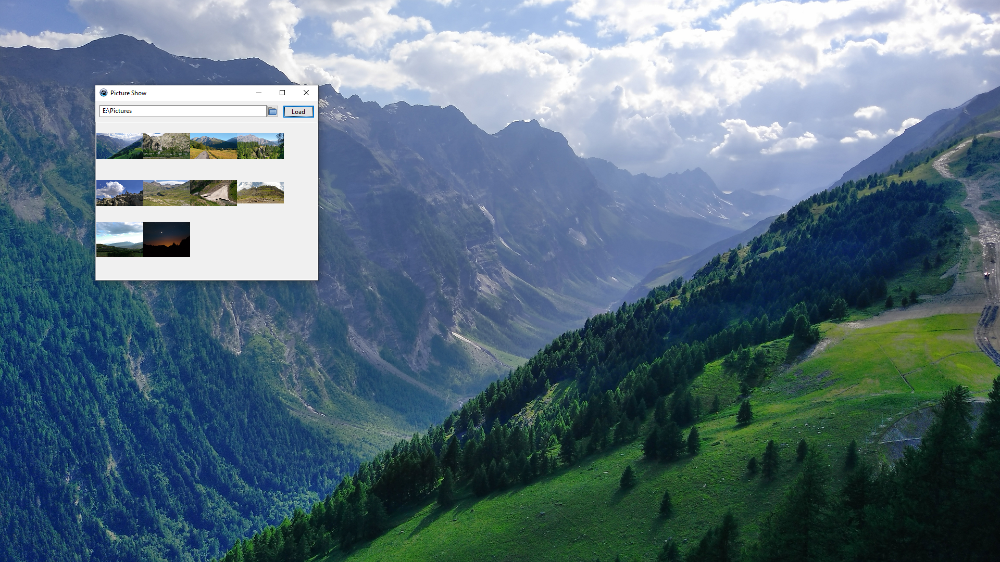

# picture-show
Click and play tool to displays images and videos on a screen or projector.
Videos are played via [MPlayerControl](https://wiki.lazarus.freepascal.org/TMPlayerControl). Make sure, you have MPlayer installed in a folder called mplayer next to the executable.

Intendet to be used in situations where a simple way to show images on demand is needed.

## Usage
1. Select the folder conatining your images and videos
2. Click Load
3. Click on an image
4. Move display window to your projector
5. Press F11 for fullscreen 
